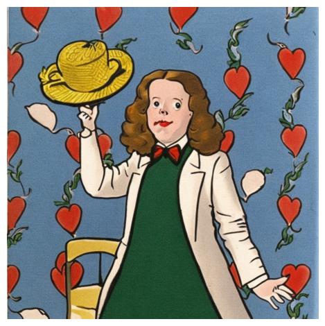
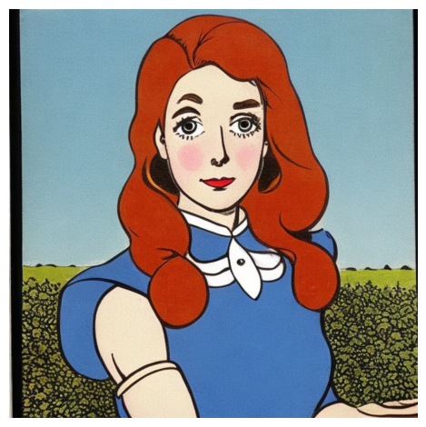
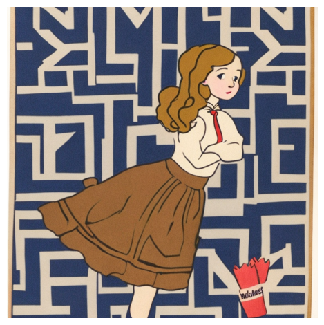
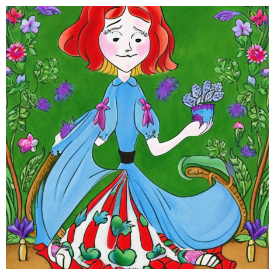
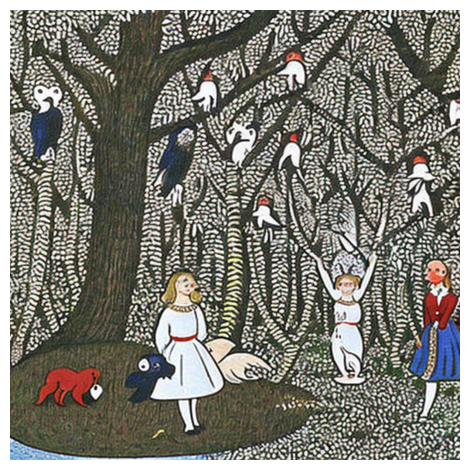
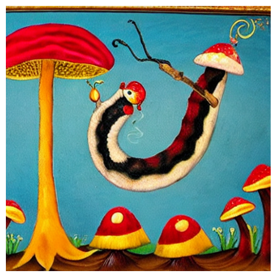
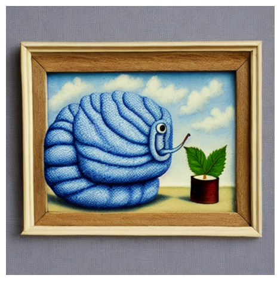
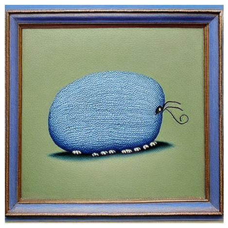
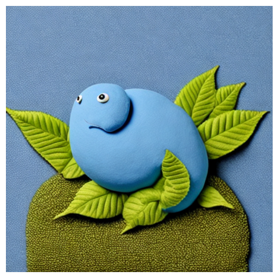
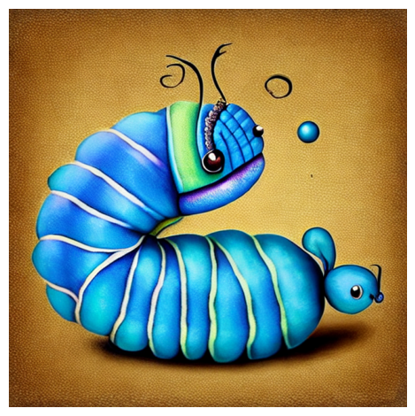

# Alice's Wonderland Illustrations in the Art Style of René Magritte


https://colab.research.google.com/drive/1873yTUWQcPeauZ2JxztlY9044VbEAwr4#scrollTo=VOOFYyqa7t0b

https://lexica.art/


This document contains the prompts and parameters for generating illustrations of characters from "Alice's Wonderland" in the art style of René Magritte.

## Alice
    ```python
    prompt = "Illustration of Alice from Alice's Wonderland in the art style of René Magritte"

    params = {
        'num_inference_steps': 400,
        'num_images_per_prompt': 1,
        'negative_parameter': 0.9,
        'negative_prompt': "digital art, futuristic, abstract, modern, contemporary, cyberpunk, sci-fi"
    }
    ```
<div>
    
    
    
    
    
</div>

## Cheshire Cat
```python
prompt = "Illustration of the Cheshire Cat from Alice's Wonderland in the art style of René Magritte"
prompt1 = "fine illustration of Cheshire Cat from the book ALices Wonderland. Cat over the tree. trippy picture, contrast colors in a painting by Rene Magritte"
prompt3 = "trippy wonderland character  black background dominant black and blue colors Halloweens Cheshire cat. Painted surrealist artstyle"

params = {
    'num_inference_steps': 400,
    'num_images_per_prompt': 1,
    'negative_parameter': 0.9,
    'negative_prompt': "digital art, futuristic, abstract, modern, contemporary, cyberpunk, sci-fi"
}
```
<div>
    
    
    
    
    
</div>


## Mad Hatter
```python
prompt = "Illustration of the Mad Hatter from Alice's Wonderland in the art style of René Magritte"

params = {
    'num_inference_steps': 400,
    'num_images_per_prompt': 1,
    'negative_parameter': 0.9,
    'negative_prompt': "digital art, futuristic, abstract, modern, contemporary, cyberpunk, sci-fi"
}


```

<div>
    
    
    
    
    
</div>

## Queen of Hearts 
```python
prompt = "fine illustration of prerry Queen of Hearts from the book ALices Wonderland. Pretty and trippy face queen. Big crown with beautiful red dress. Artstyle painting by Rene Magritte"

params = {
    'num_inference_steps': 400,
    'num_images_per_prompt': 1,
    'negative_parameter': 0.9,
    'negative_prompt': "digital art, futuristic, abstract, modern, contemporary, cyberpunk, sci-fi"
}


```
<div>
    
    
    
    
    
</div>


## Caterpillar
```python
prompt = "Blue magical caterpillar painted in surrealistic artstyle"

params = {
    'num_inference_steps': 40,
    'num_images_per_prompt': 1,
    'negative_parameter': 0.9,
    'negative_prompt': "digital art, futuristic, abstract, modern, contemporary, cyberpunk, sci-fi"
}


```

<div>
    
    
    
    
    
</div>

