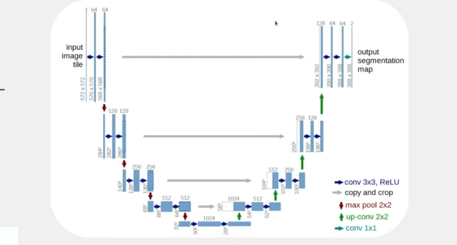
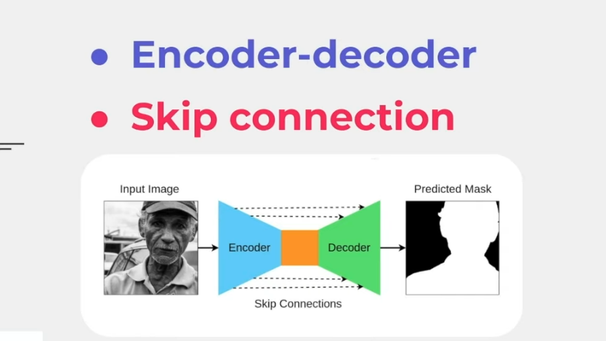

# Neural Network Architecture: U-Net

**Introduction:**
- U-Net is one of the most famous and important segmentation architectures.
- It was developed in 2015, specifically to learn from small samples.
- The input and output have the same size.

**U-Net Structure:**
1. **Encoder (Contracting Path):**
   - Receives the input image and extracts important features through multiple convolutional layers.
   - Performs down-sampling, reducing the image resolution by half at each level while increasing the number of channels to capture high-level information.
   
2. **Decoder (Expansive Path):**
   - Performs up-sampling of the features using transposed convolutions.
   - Concatenates the recovered features with the corresponding features from the encoder through skip connections.
   - As a result, produces a segmented mask of the original input image.

**Skip Connections:**
- **Definition:**
  - Direct connections that link corresponding layers of the encoder and decoder.
- **Functioning:**
  - At each down-sampling level in the encoder, the output of the convolutional layers is saved.
  - During the up-sampling process in the decoder, these saved features are concatenated (or added) with the corresponding features from the decoder.
  - They allow the network to use both high-level features (extracted by the encoder) and low-level features (recovered by the skip connections).
- **Benefits:**
  - Preservation of low-level information, such as edges, textures, and fine details.
  - Improved segmentation accuracy by combining information from different resolution levels.

**Down-sampling and Up-sampling Process (with DDPM):**
- **Down-sampling:**
  - Reduces the spatial resolution of the image by half at each level, preserving the main features and patterns.
  - Compresses the information into a smaller space.
- **Up-sampling:**
  - Increases the spatial resolution to recover the original image dimension.
  - Predicts the details that were reduced during down-sampling, using the embedded information.

**Summary:**
- U-Net is effective for image segmentation, allowing the capture and integration of information at multiple scales through its symmetric structure and the use of skip connections.

