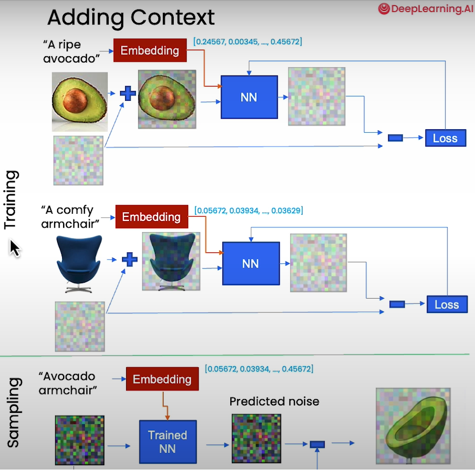
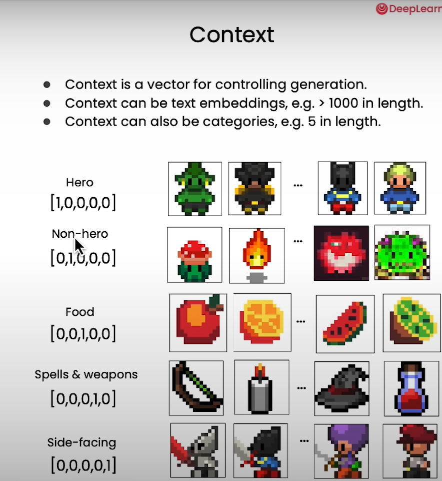
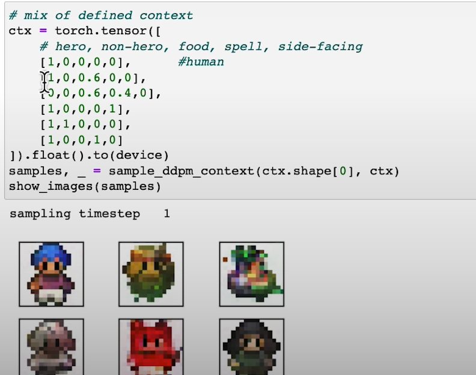

# Controlling Models Through Embeddings

## How Does Embedding Become Context for the Model?
Embedding is integrated into the neural network (NN) to predict the noise added to the object you want to control. The model computes the loss and iteratively learns from the embedding. This process allows the model to use the embedding as context.

## Embedding Description
Each embedding is associated with a description or caption. During sampling time (DDPM method), you can mix these captions to create new, combined generations. For example:
- Caption 1: "Abacaxi" (Pineapple)
- Caption 2: "Cadeira" (Chair)
- Mixed Caption: "Abacaxi de Cadeira" (Pineapple Chair)

## Visual Representation

### Controlling Architecture:

## What is Context?
- Context is a vector used to control generations.

## Embedding Dimensions
Embeddings can be embedded in various dimensions. Below are visual representations:

### Context Embedding:

### Mixing Context:

