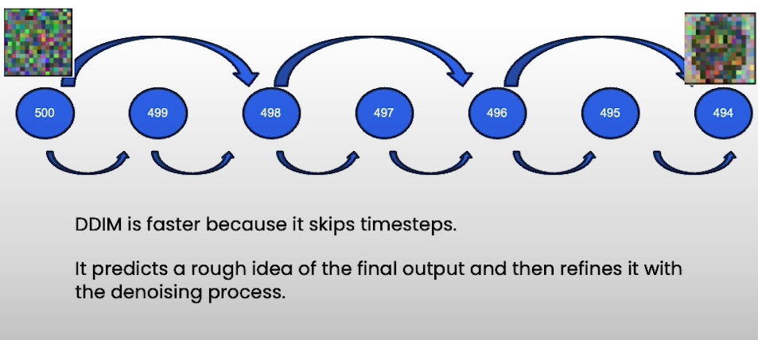

# Reasons for Slow Sampling Process

- **Too Many Steps:** The sampling process involves a large number of steps, which increases the time required.
- **Dependency on Previous Steps:** Each timestep depends on the previous one, making the process sequential and slower.

## Diffusion Models Overview

Diffusion models are a class of generative models that iteratively denoise data starting from random noise, producing high-quality samples. There are different types of diffusion models, such as DDPM and DDIM, each with its strengths and weaknesses.

### DDPM (Denoising Diffusion Probabilistic Model)

DDPM is a widely-used diffusion model that excels in generating high-quality images but often requires a large number of steps to achieve good results.

- **Advantages:**
  - High-quality image generation.
  - Well-established and extensively studied.

- **Disadvantages:**
  - Slow sampling process due to a high number of steps.
  - Each step depends on the previous one, leading to inefficiencies.

### DDIM (Denoise Diffusion Implicit Model)

DDIM is an improved version of diffusion models that addresses some of the inefficiencies found in DDPM. It modifies the denoising process to allow for fewer steps while maintaining quality.

- **Advantages:**
  - Faster sampling with fewer steps.
  - Works effectively with under 500 steps.
  - Maintains high-quality results comparable to DDPM in fewer iterations.

- **Disadvantages:**
  - May not match the quality of DDPM for very high step counts (over 500 steps).

## Comparison: DDPM vs. DDIM

| Feature                | DDPM                                | DDIM                                |
|------------------------|-------------------------------------|-------------------------------------|
| **Steps Required**     | Over 500 for high quality           | Under 500 for similar quality       |
| **Sampling Speed**     | Slower due to high step count       | Faster due to reduced steps         |
| **Dependency**         | Each step depends on the previous one | Modified process reduces dependency |
| **Use Case**           | Best for applications where high quality is paramount and speed is less critical | Ideal for scenarios where faster generation is necessary without significant loss in quality |

DDIM modifies the traditional diffusion process, allowing for more efficient sampling. The image above shows the flow of DDIM, illustrating how it reduces the number of steps required.

## Conclusion

While DDPM is suitable for applications requiring the highest quality and can tolerate slower generation speeds, DDIM provides a faster alternative with comparable quality for under 500 steps. This makes DDIM a preferred choice for applications needing quicker turnaround times.
